 
## 查看主页获取源码

> **作者介绍**： **✌**全网粉丝10W+本平台特邀作者、博客专家、CSDN新星计划导师、java领域优质创作者,博客之星、掘金/华为云/阿里云/InfoQ等平台优质作者、专注于项目实战 **✌**

  

### 一、作品包含

源码+数据库+设计文档万字+PPT+全套环境和工具资源+部署教程

### 二、项目技术

前端技术：Html、Css、Js、Vue、Element-ui

数据库：MySQL

后端技术：Java、Spring Boot、MyBatis

  

### 三、运行环境

开发工具：IDEA/eclipse + 微信开发者工具

数据库：MySQL5.7

数据库管理工具：Navicat10以上版本

环境配置软件： JDK1.8+Maven3.6.3

前端Nodejs：14

### 四、项目介绍
项目编号：mpweixinA034

随着我国高等教育事业的快速发展，越来越多的大学生需要通过勤工助学来减轻家庭经济负担，同时提高自身的社会实践能力和就业竞争力。然而，传统的勤工助学管理方式存在信息不对称、流程复杂、效率低下等问题，难以满足广大大学生的需求。为了解决这些问题，大学生勤工助学管理小程序应运而生。

前台分为学生和企业
学生功能：首页、企业招聘、通知公告、勤工助学、我的。
企业功能：首页、企业招聘、通知公告、勤工助学、我的。

后台管理员的功能：系统首页、个人中心、学生管理、企业管理、职业类型管理、企业招聘管理、已投简历管理、面试邀请管理、录用信息管理、学生简历管理、通知公告管理、学生考核管理、学生薪酬管理和系统管理。

### 五、运行截图

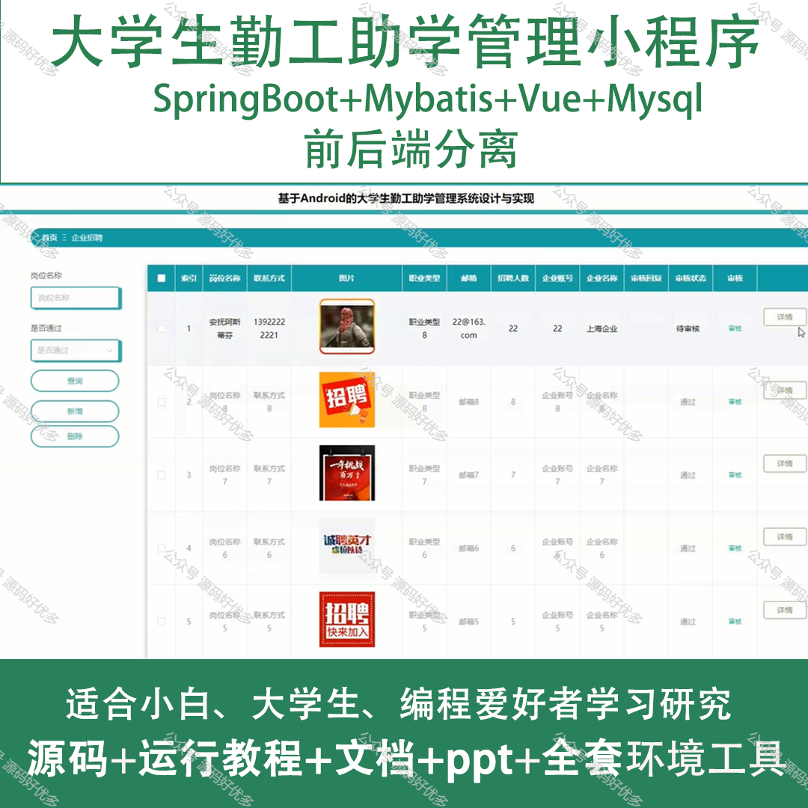
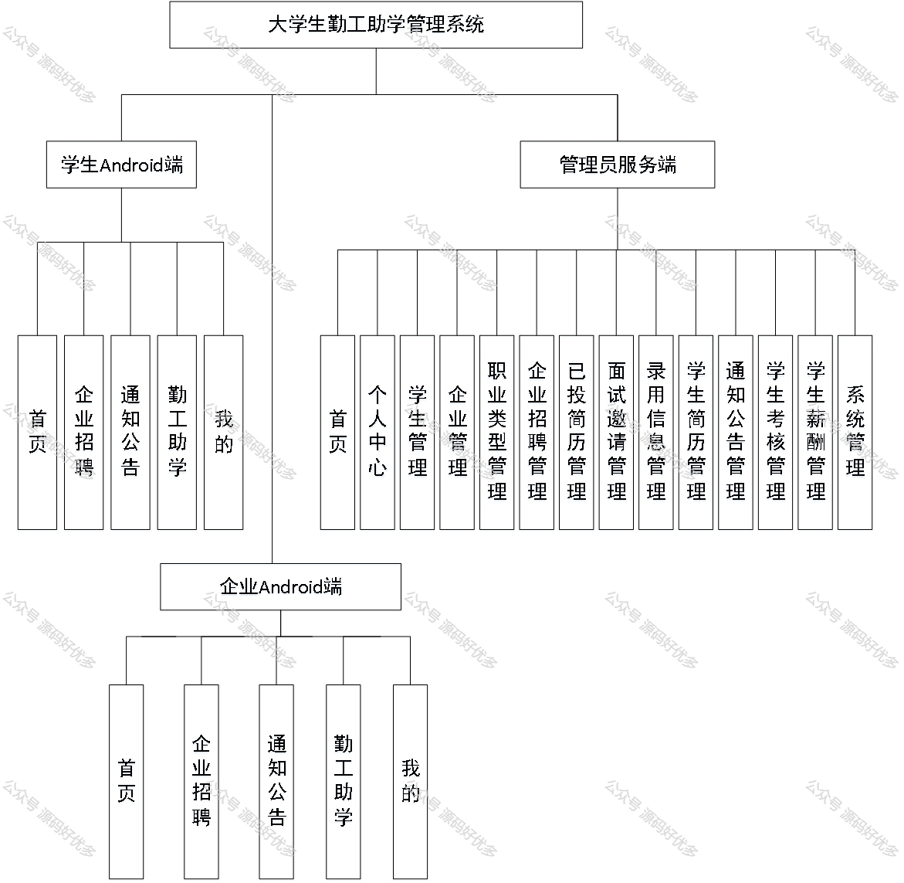
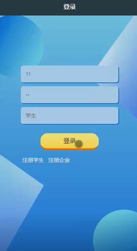
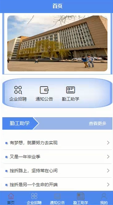
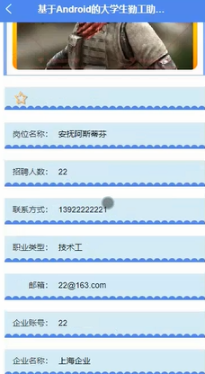
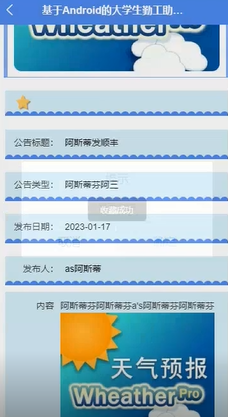
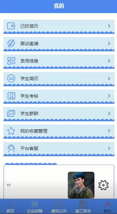
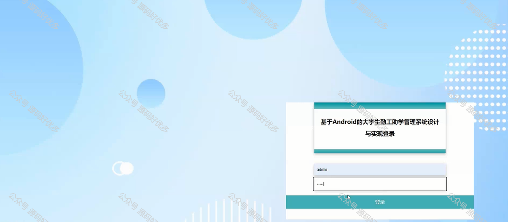
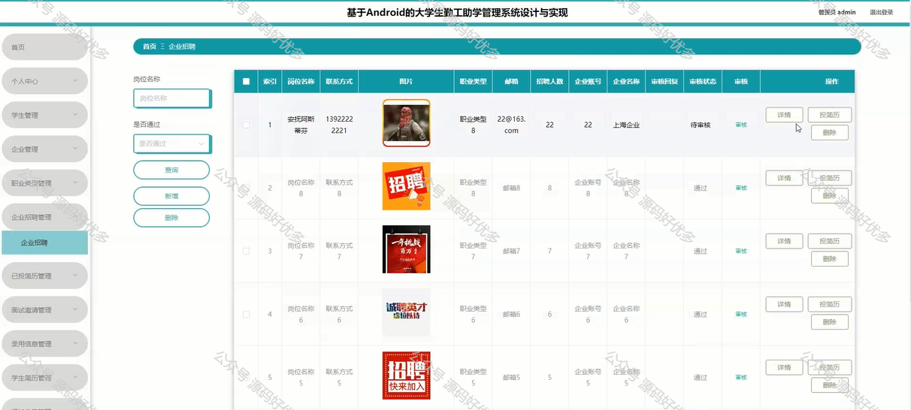
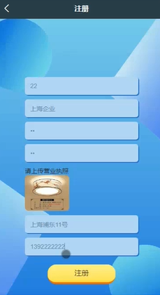
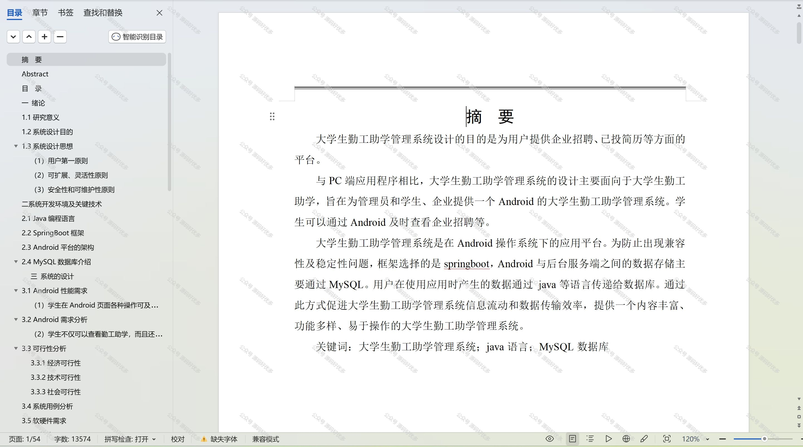

  
